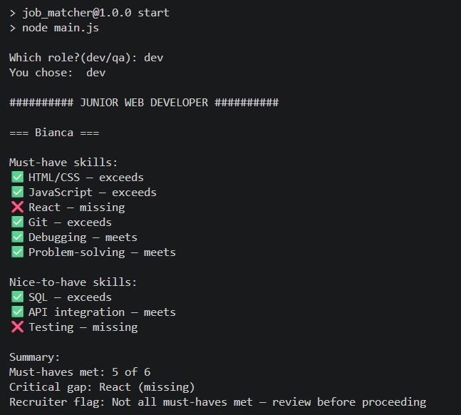

# Job Matcher

A backend tool that matches candidate profiles against a job description using a skill-by-skill matrix — not a single blended percentage, which can hide critical gaps.

Built as a hands-on project to learn JavaScript and Node.js from scratch, as the first module of a larger idea: a more authentic, evidence-based professional networking platform, where profiles are backed by verifiable skill evidence instead of self-reported claims.

## How it works

Each candidate's skills are rated 0–3 (no evidence → advanced) with supporting evidence text. 
Each job requirement is marked must-have or nice-to-have.
The matcher compares the two and reports, per skill, whether the candidate is missing, below, meeting, or exceeding the requirement — prioritizing must-haves first, then a summary flag.

## Running it

```bash
npm install
npm start
```

You'll be prompted to choose a role (`dev` or `qa`), then see a full match report for each candidate in that pool.

## Running tests

```bash
npm test
```

## Project structure

```
src/
  data/        — candidate profiles and job descriptions (JSON)
  matcher.js   — matching logic
  display.js   — formats and prints results
main.js        — entry point, handles user input
matcher.test.js — automated tests
```

## Sample output



## What's next

- Build a real HTTP API (Express)
- Expand test coverage
- Add a UI